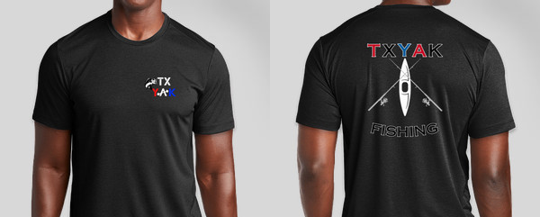
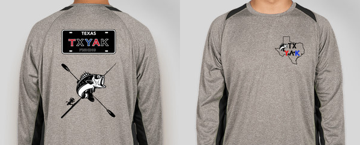
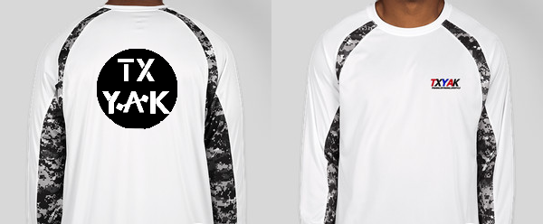

<!DOCTYPE html>
<html lang="en-US">
  <head>
    <meta charset="UTF-8" />
    <meta name="viewport" content="width=device-width, initial-scale=1" />
    <meta name="description" content="Basic website" />
    <meta name="keywords" content="ITSE-2302 Final (T-Shirt Company)" />
    <link rel="preconnect" href="https://fonts.gstatic.com" />
    <link
      href="https://fonts.googleapis.com/css2?family=Noto+Sans+JP:wght@300;500&family=Raleway:wght@500&display=swap"
      rel="stylesheet"
    />
    <!-- link to external css -->
    <!--<link rel="stylesheet" type="text/css" href="CSS/styles.css" />-->
    <link rel="stylesheet" type="text/css" href="/CSS/main.css">

    <!-- ***link to external javascript files***-->
    

    <title>TXYAK</title>

    <link rel = "icon" href = "images/LOGOicon2.ico" 
        type = "image/x-icon">
    <!--     
            Tristen Ellis 
            ITSE - 2302
            Unit 7 Final Project
            DESC: Fishing shirt/Merch site 
            

    -->
  </head>
  <!-- 
    ================ Header ======================
   -->
  <body>
    <header>
    

        <h1>TXYAK</h1>
        <h3 style="color: White;">Texas Kayak Fishing</h3>
  </header>
    <!-- 
    ================= NAV =====================
   -->
  <section>
    <button class="btnNav"><a href="#">Home</a> </button>
    <button class="btnNav" ><a href="#">News</a></button>
    <button class="btnNav"><a href="#">Merch</a></button>
    <button class="btnNav" >Contact</button>
  </section>
  <!-- 
    ================= Cart menu  =============
   -->
  

    <h3>CART</h3>
      

    
items

    <ul id="items">
      
    </ul>
    <h3> Subtotal($):</h3>
    <h3 id="subtotal">0.00</h3>
    
    <button class="btnCart"  onclick="toggleForm(); frmValues()">CHECKOUT</button>
     
    <button type="button" class="btnCart" id="btnClear" onclick="reset()">Clear cart</button>

<!-- 
  =========== checkout overlay ================
-->

  <!-- toggleform()  -->
  

  <h2>Checkout</h2>
  
 Order Details: 

  <!-- simple div whith a background color to act as a 
    white line/visual content seperator-->
  

  <!-- ul id="details" holds no <li>'s before 
    javascript adds selected items via .innerHTML-->
  <ul id="details"></ul>
  <!-- 1 Text  Input -->
  

    <label for="fullname">Fullname</label>
    <input type="text" id="fullname">
  

  <!-- 2 Email Input -->
  

    <label for="email">Email</label>
    <input type="email" id="email">
  

  <!-- 3 checkbox Input -->
  

    <label for="mailList">Recieve future email promoions and offers</label>
    <input type="checkbox" id="mailList">
  

  <!-- Text feild input -->
  

    <label for="instructions">Special delivery instructions</label>
    <input type="text" id="instructions">
  

  

    <button id="confirm" onclick="confirm()">Place Order</button>
    <!-- cancel button clears form -->
    <button id="reset" onclick="toggleForm(); openCart()">Cancel</button>
    <button type="button" id="btnPrint"  onclick="window.print()">Print</button>
    <button type="button" id="btnClose" onclick="toggleForm(); reset()">Close</button>
  
  

    <!-- 
    =============== Design 1 =============
   -->
   <section class="wrap">
     <h2>TXYAK MERCH</h2>
     

    

       
    

     

      <h3>TXYAK X SHORTY PRO BASS   ANGLER SHORT SLEEVE  $20</h3>
      
The most comfortable tee for on and off the water. Get ready- this is your next favorite tee.

    

    

      
        <!--4 Radio input -->
        <input type="radio" id="S1" name="shorty_pro" value="Small">
        <label for="S1">Small</label>

        <input type="radio" id="M1" name="shorty_pro" value="Medium">
        <label for="M1">Medium</label>

        <input type="radio" id="L1" name="shorty_pro" value="Large">
        <label for="L1">Large</label>
         
         

        <button class="btnfrm" id="btnAddD1" onclick="addD1()">Add to cart</button>
   
    

      <!-- 
    ================= Design 2 ===================
   -->
   

    

      
    

    

     <h3>TXYAK TEXAS SPECIAL X PERFORMANCE  LONG SLEEVE  $25</h3>
     
The TEXAS SPECIAL Long Sleeve has advanced technology desined for performance fishing comfort, with hardcore anglers in mind.

   

  

      
   
      <input type="radio" id="S2" name="texas" value="Small">
      <label for="S2">Small</label>

      <input type="radio" id="M2" name="texas" value="Medium">
      <label for="M1">Medium</label>

      <input type="radio" id="L2" name="texas" value="Large">
      <label for="L2">Large</label>
       
       

      <button class="btnfrm" id="btnAddD2" onclick="addD2()">Add to cart</button>
 
  

      <!-- 
    =================== design 3 ======================
   -->
   

    

      
    

    

     <h3>TXYAK GHOST X ICON WHITE OG LONG SLEEVE $30</h3>
     
With +UPF 30 to block UVA and UVB rays for all-day sun protection, stain-resistant, anti-microbial treatments, and superior breathability, the GHOST is a must-have for any angler's arsenal. 

   

   

      
  
      <input type="radio" id="S3" name="texas" value="Small">
      <label for="S3">Small</label>

      <input type="radio" id="M3" name="texas" value="Medium">
      <label for="M3">Medium</label>

      <input type="radio" id="L3" name="texas" value="Large">
      <label for="L3">Large</label>
       
       

      <button class="btnfrm" id="btnAddD3" onclick="addD3()">Add to cart</button>
 
  

  

</section>
  <!-- 
    ====================================
   -->
      <footer>
      
          <address>
           
            <a href="mailto:tellis22@gmail.com" title="Email: tellis22@gmail.com">Contact us</a>
           
           
            <a href="https://tstc.edu">Instagram</a>
           
           
            TX&#44; USA
        
          </address>
        
      </footer>
    
  </body>
</html>
